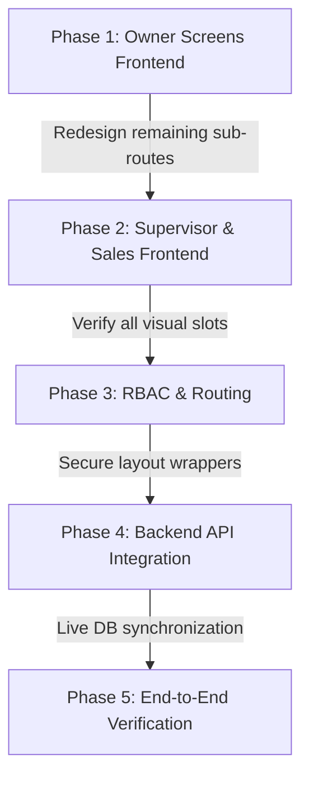

# KVR Motors ERP - Development Roadmap & Next Steps

This document outlines the systematic, professional engineering roadmap to build, integrate, and verify the complete **KVR Motors ERP** ecosystem, taking you from frontend mock screens to a fully live, database-backed enterprise system.

---

## 🗺️ High-Level Project Roadmap

---

## 🏃‍♂️ Phase-by-Phase Execution Guide

### 📍 Phase 1: Complete the Owner Role Frontend Screens (CURRENT FOCUS)
You have successfully locked the design for the core Owner tabs (Home, Inventory, Sales, Team, Settings). The remaining sub-route screens are currently fully dark and need to be redesigned to match the unified light viewport backdrop and dark obsidian hero header theme.

* **Target Screens**:
  1. **Showroom Bookings & advance Deposits** (`owner/bookings.tsx`)
  2. **Branch Performance Comparison** (`owner/branches.tsx`)
  3. **Enquiry Pipeline & Lead Funnel** (`owner/leads.tsx`)
  4. **Capital Audit Vault & Auto-Journal Ledger** (`owner/ledger.tsx`)
  5. **Purchase Orders & Factory Deliveries** (`owner/purchases.tsx`)
* **How to proceed**:
  * Open `prompts.md` in your workspace.
  * Locate **Screen 5** to **Screen 9**.
  * Run the designated optimized prompt on the corresponding file one-by-one.
  * *Verification*: Verify that the elastic scroll bounce, title descenders (`lineHeight`), and scroll-to-top resets perform flawlessly under hot-reloading.

---

### 👥 Phase 2: Implement Supervisor, Sales Executive & Staff App Screens
Once the Owner role is complete, you should proceed with the other core business personas inside the enterprise structure.

#### 1. Supervisor Role App Screens (`/supervisor/...`)
* **Purpose**: Shepherds daily operations, godown stock transfers, active PDI check sheets, and delivery approvals.
* **Core Screens**:
  * **Supervisor Dashboard**: Showroom telemetry, stock alert flags, and pending PDI count widgets.
  * **Stock Transfer Logs**: Inter-outlet vehicle/battery transfers between godowns.
  * **PDI Checklist Engine**: Interactive lists with radio switches to authorize/reject ready EV units.
  * **Staff Shift Registry**: Oversee active hours of sales desk executives.

#### 2. Sales Executive Role App Screens (`/sales/...`)
* **Purpose**: Customer-facing bookings registration, enquiry creation, and test drive logging.
* **Core Screens**:
  * **Sales Executive Dashboard**: Personal monthly target rings, daily leads queue, and WhatsApp ping hooks.
  * **New Lead Form**: Quick registration flow for new walk-ins or phone enquiries.
  * **Token Booking Portal**: Register immediate token deposits and select EV colors.
  * **Test Drive Scheduler**: Associate available showroom test vehicles with prospective leads.

#### 3. Sales Staff & Delivery Crew Role App Screens (`/staff/...` or `/delivery/...`)
* **Purpose**: Tailored for showroom yard staff, godown keepers, and delivery runners to execute physical transport, check handovers, and manage vehicle service checklists.
* **Core Screens**:
  * **Staff Operations Dashboard**: Simple, high-contrast visual feeds displaying assigned delivery handovers, pending godown transfers, and repair tickets.
  * **Digital Customer Handover Portal**: Sleek interactive checklist (keys, battery charger, owner's manual, warranty card) featuring a digital signature pad and instant photo capture tool of the physical vehicle at delivery.
  * **Godown Stock Mover (Barcode/QR Scan)**: Quick QR scanning screen (or alphanumeric text inputs) to record when a vehicle or battery physically leaves the Vizag main warehouse for Kakinada or Srikakulam showrooms.
  * **EV Service & Repairs Logger**: Diagnostic reporting sheet for showroom mechanics to record battery SoC diagnostics, thermal limits, and parts replaced during routine maintenance.

---

### 🔒 Phase 3: Unified Authentication & Role-Based Access Control (RBAC)
With the frontend layouts and screens ready for all roles, integrate the secure access gateway.

* **Context Hooking**: Bind the active layout switcher to the `useAuth` session context.
* **Router Routing**:
  * Ensure that logging in as `role: 'owner'` automatically pushes to `/owner/dashboard`.
  * Logging in as `role: 'supervisor'` redirects to `/supervisor/dashboard`.
  * Logging in as `role: 'sales_executive'` redirects to `/sales/dashboard`.
* **Tenant Isolation**: Secure the route directories so that non-authorized roles are immediately kicked back to the `/login` gateway.

---

### 🔌 Phase 4: Full Backend API & Database Integration
Transition the frontend from local static mock states to real-time database-driven synchronization against your Django REST Framework backend.

* **API Client Mappings**:
  * Swap static `useState` mock lists for live `api.get()` queries (e.g. fetch physical stock from `/api/vehicle-units/`).
  * Hook up interactive form submissions (e.g. creating a sales invoice, adding staff, placing POs) to `/api/` endpoints with proper validation.
* **Real-time Synchronization**:
  * Configure pull-to-refresh (`RefreshControl`) states to execute backend refetches.
  * Add optimistic UI updates on forms to maintain instantaneous touch responsiveness before server confirmation.
* **Capital Ledgers & GST Tracking**:
  * Ensure every sold unit or advance deposit automatically journals a Credit/Debit entry in the Django backend, recalculating capital balances and GST liabilities.

---

### 🧪 Phase 5: Verification, Automated Testing, & Delivery
* **Interactive Reviews**: Go through the critical user journeys (Creating an Enquiry $\rightarrow$ Booking a Test Drive $\rightarrow$ Placing a Token Deposit $\rightarrow$ Generating a Factory PO $\rightarrow$ PDI Verification $\rightarrow$ Invoice Settlement $\rightarrow$ Ledger Auto-Journaling).
* **Automated TestSuite Execution**:
  * Proactively utilize **TestSprite** MCP endpoints to run end-to-end frontend and backend automated verification pipelines.
  * Test network failures, validation edge-cases (e.g., negative prices, invalid phone formats), and multi-device session concurrency.
